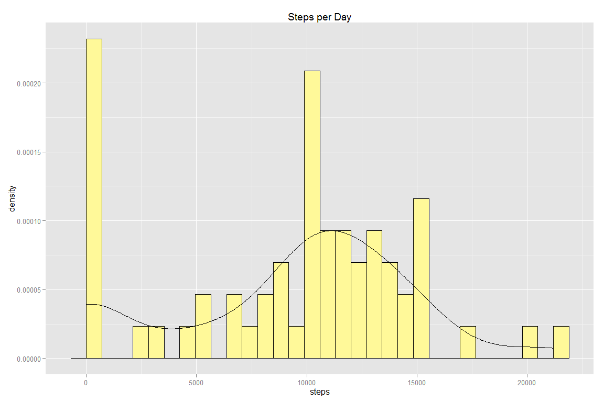
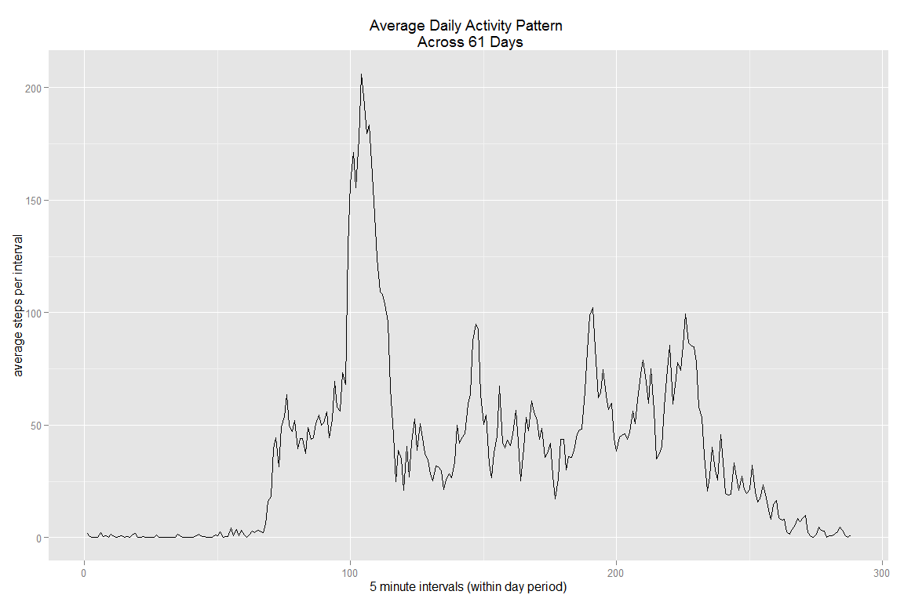
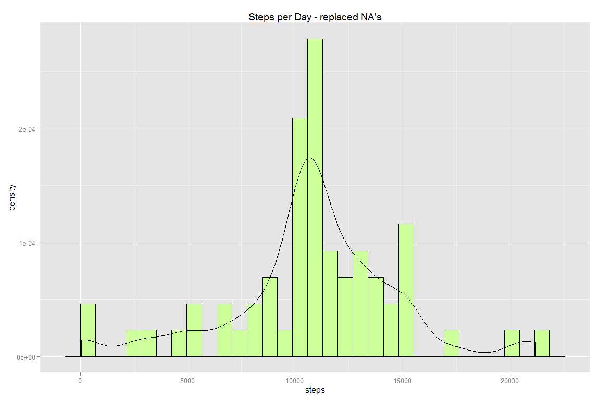

# Reproducible Research: Peer Assessment 1


## Loading and preprocessing the data

```r
# Load data
temp <- tempfile()
setInternet2(use = TRUE)
link <- "https://d396qusza40orc.cloudfront.net/repdata%2Fdata%2Factivity.zip"
download.file(link, temp)
activity.data <- read.csv(unz(temp, "activity.csv"))
unlink(temp)
```


## What is mean total number of steps taken per day?

```r
#data frame of steps per day (sum of steps for each 61 days)
library(dplyr)
daily.steps <- activity.data %>%
  group_by(date) %>%
  summarize(steps = sum(steps, na.rm = TRUE))

#make histogram of daily steps taken
library(ggplot2)
s <- NULL
s <- ggplot(data = daily.steps, aes(steps))
s <- s + geom_histogram(aes(y=..density..), colour = "black", fill = I('#FFF999'))
s <- s  + geom_density(aes(y=..density..)) + ggtitle("Steps per Day")
s
```

 

```r
#Mean daily steps 
Mean <- mean(daily.steps$steps, na.rm = TRUE)
Mean
```

```
## [1] 9354.23
```

```r
#Median daily steps
Median <- median(daily.steps$steps, na.rm = TRUE)
Median
```

```
## [1] 10395
```


## What is the average daily activity pattern?

```r
#make dataset contianing mean of each 5 min interval of the day
activity.data$daily.interval <- rep(1:288, 61) # 24h*60m/5m=288 5 min intervals in day
daily.pattern <- activity.data %>%
  group_by(daily.interval) %>%
  summarise(steps.by.interval = mean(steps, na.rm = TRUE))

#make plot of mean steps of each 5 min interval
d <- NULL
d <- ggplot(data = daily.pattern, aes(x = daily.interval, y = steps.by.interval))
d <- d + geom_line()
d <- d + ggtitle("Average Daily Activity Pattern \n Across 61 Days") + 
  xlab("5 minute intervals (within day period)") + ylab("average steps per interval")
d
```

 


## Imputing missing values

```r
#Calculate and report the total number of missing values in the dataset
nas <- is.na(activity.data$steps)
missing.step.intervals <- sum(nas)
missing.step.intervals
```

```
## [1] 2304
```

```r
#add a new colomn of mean steps by each interval, repeated for each day
activity.data$steps.by.interval <- rep(daily.pattern$steps.by.interval, 61)
#add new colum to be able to replace NA values from steps
activity.data$replace.na.steps <- activity.data$steps
#replace NA values in new column with Mean steps for the corresponding interval
activity.data[,6] <- replace(activity.data[,6], is.na(activity.data[,1]), activity.data[,5])

#test if replaced NA worked
all.equal(activity.data[is.na(activity.data$steps),5], #mean step by interval column
          activity.data[is.na(activity.data$steps),6]) #Replaced NA column
```

```
## [1] TRUE
```

```r
all.equal(activity.data[!is.na(activity.data$steps),1], #steps column
          activity.data[!is.na(activity.data$steps),6]) #Replaced NA column
```

```
## [1] TRUE
```

```r
#data frame of steps per day (sum of replaced NA steps taken within each date)
daily.steps.replaced.na <- activity.data %>%
  group_by(date) %>%
  summarize(steps = sum(replace.na.steps, na.rm = TRUE))

#histogram of daily steps taken with replaced NA values by 5' integer
c <- NULL
c <- ggplot(data = daily.steps.replaced.na, aes(steps))
c <- c + geom_histogram(aes(y=..density..), colour = "black", fill = I('#ccff99'))
c <- c  + geom_density(aes(y=..density..)) + 
  ggtitle("Steps per Day - replaced NA's")
c
```

 

```r
#Mean daily steps - replaced NA's
Mean.replaced <- mean(daily.steps.replaced.na$steps)
Mean.replaced
```

```
## [1] 10766.19
```

```r
#Median daily steps - replaced NA's
Median.replaced <- median(daily.steps.replaced.na$steps)
Median.replaced
```

```
## [1] 10766.19
```


## Are there differences in activity patterns between weekdays and weekends?

```r
#create vector of days of week
library(lubridate)
activity.data$wkdy <- wday(activity.data$date)

#create vector of Weekend/Weekday
activity.data$day <- vector(mode = "character", length = 17568)

for(i in 1:17568){
  if (activity.data[i,7] == 1) { 
    activity.data[i,8] <- "Weekend" #add weekend for 1 (sundays)
  } else if (activity.data[i,7] == 7) {
    activity.data[i,8] <- "Weekend" #add weekend for 7 (saturdays)
  } else {
    activity.data[i,8] <- "Weekday" #add weekday for all esle
  }
}

#turn "day" variable into factor for plotting purposes
activity.data$day <- as.factor(activity.data$day)

#data frame contianing mean of each 5 min interval of the day using replaced na data
daily.pattern.rmna <- activity.data %>%
  group_by(day, daily.interval) %>%
  summarise(steps.by.interval = mean(replace.na.steps))


#create plot of average activity pattern of weekend vs weekday
w <- NULL
w <- ggplot(data = daily.pattern.rmna, aes(x = daily.interval, y = steps.by.interval))
w <- w + geom_line()
w <- w + facet_wrap(~day, ncol = 1)
w <- w + ggtitle("Average Daily Activity Pattern Across 61 Days") + 
  xlab("5 minute intervals (within day period)") + ylab("average steps per interval")
w
```

 
